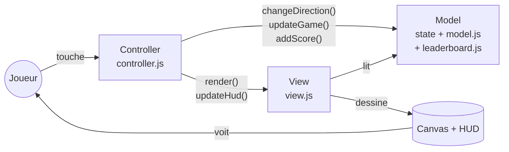
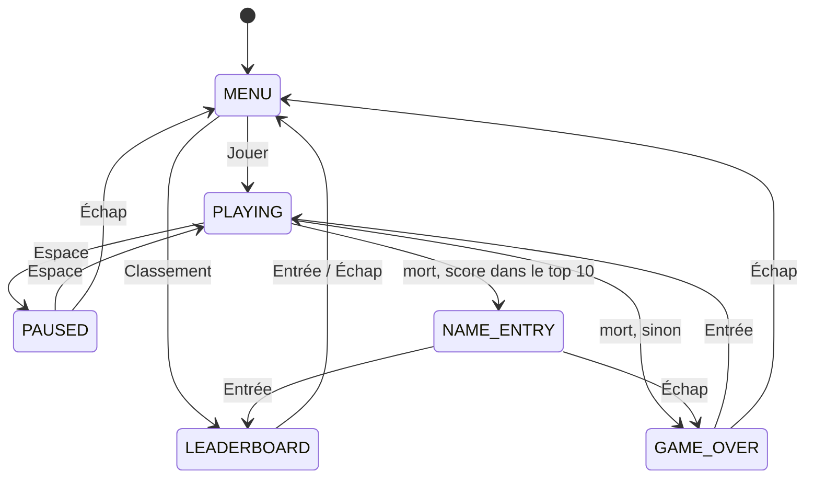

# SnakeWithAi

Un jeu Snake en JavaScript « vanilla » (HTML + CSS + JS, sans framework ni bibliothèque), dessiné dans un `<canvas>` avec des sprites en pixel art.

---

## 1. Présentation et objectif pédagogique

Ce projet est un exercice : construire un Snake complet **avec l'aide d'une IA**, mais en restant capable d'**expliquer chaque fonction à l'oral**.

Le code suit donc quelques règles strictes :

- des **fonctions courtes**, qui font une seule chose, avec des noms explicites en anglais ;
- **aucun nombre magique** : tous les réglages sont regroupés dans `js/config.js` ;
- des **commentaires en français**, écrits comme si on expliquait le code à un camarade ;
- une architecture claire (**MVC**, voir la partie 6), pour savoir immédiatement où chercher quoi.

Le serpent se déplace sur une carte de sable parsemée de rochers et d'arbres. Il mange des pommes pour grandir, accélère de niveau en niveau, et les meilleurs scores sont gardés dans un classement.

---

## 2. Lancer le jeu

Le code est découpé en **modules ES** (`import` / `export`). Pour des raisons de sécurité, les navigateurs refusent de charger ces modules quand on ouvre `index.html` directement en double-cliquant (adresse en `file://`). Il faut donc lancer un petit serveur local depuis le dossier du projet :

```bash
python3 -m http.server 8000
# ou, si Node.js est installé :
npx serve
```

Puis ouvrir **http://localhost:8000** dans le navigateur.

### Commandes

| Touche | Action |
|---|---|
| Flèches, **ZQSD** (AZERTY) ou **WASD** (QWERTY) | Diriger le serpent / choisir dans le menu |
| **Espace** | Pause / reprise |
| **Entrée** | Valider (menu, pseudo, rejouer) |
| **Échap** | Revenir au menu / ne pas enregistrer son score |
| **Retour arrière** | Effacer une lettre du pseudo |

---

## 3. Structure des fichiers

```
SnakeWithAi/
├── index.html            La page : titre, barre de score (HUD), <canvas>, charge js/main.js
├── style.css             Mise en page : centrage, fond sombre, sprites nets (pixelated)
├── README.md             Ce document
├── PROMPT.md             Le cahier des charges donné à l'IA
├── assets/
│   ├── snake_spritesheet.png   Tous les dessins du jeu (tuiles de 16×16 px)
│   └── crunch.wav              Le son joué quand le serpent mange
├── js/
│   ├── config.js         Les bases : constantes réglables + l'objet `state` (état du jeu)
│   ├── main.js           Point d'entrée : charge tout et affiche le menu
│   ├── assets.js         Chargement de la spritesheet et du son
│   ├── model.js          MODEL : règles du jeu (déplacement, collisions, pommes, niveaux)
│   ├── leaderboard.js    MODEL : classement top 10 et dernier pseudo (localStorage)
│   ├── view.js           VIEW : tout le dessin dans le canvas + mise à jour du HUD
│   ├── controller.js     CONTROLLER : clavier, changements d'écran, boucle de jeu
│   └── ressources.zip    Archive d'une ancienne version (non utilisée par le jeu)
└── snake.zip             Archive d'une ancienne version (non utilisée par le jeu)
```

---

## 4. Les bases du projet

Toutes les valeurs réglables sont dans **`js/config.js`**, chacune avec un commentaire. Pour modifier le jeu, c'est le premier fichier à ouvrir.

### 4.1 La fenêtre de jeu

Le plateau est une **grille de cases**. Le serpent et les pommes se déplacent de case en case, jamais au pixel près. Une position est un objet `{ x, y }` : `x` va de 0 (gauche) à 29 (droite), `y` de 0 (haut) à 24 (bas).

| Constante | Valeur | Rôle |
|---|---|---|
| `CELL_SIZE` | `32` | Taille d'une case à l'écran, en pixels (les sprites de 16 px sont agrandis ×2) |
| `COLUMNS` | `30` | Nombre de cases en largeur |
| `ROWS` | `25` | Nombre de cases en hauteur |
| `CANVAS_WIDTH` | `960` | Largeur du canvas = `COLUMNS × CELL_SIZE` |
| `CANVAS_HEIGHT` | `800` | Hauteur du canvas = `ROWS × CELL_SIZE` |

La taille du canvas n'est pas écrite dans le HTML : c'est `initView()` qui la fixe à partir de ces constantes.

### 4.2 La vitesse et son évolution

| Constante | Valeur | Rôle |
|---|---|---|
| `INITIAL_SPEED_MS` | `150` | Temps entre deux pas au niveau 1 (plus c'est petit, plus c'est rapide) |
| `SPEED_STEP_MS` | `10` | Temps retiré à chaque nouveau niveau |
| `MIN_SPEED_MS` | `60` | Vitesse maximale : on ne descend jamais en dessous |
| `FOOD_PER_LEVEL` | `5` | Pommes à manger pour passer au niveau suivant |

Niveau 1 : 150 ms → niveau 2 : 140 ms → … → niveau 10 : 60 ms, puis la vitesse ne bouge plus.

### 4.3 La nourriture

| Constante | Valeur | Rôle |
|---|---|---|
| `FOOD_POINTS` | `1` | Points d'une pomme rouge |
| `SPECIAL_FOOD_MULTIPLIER` | `2` | La pomme dorée rapporte 2 × plus |
| `SPECIAL_FOOD_CHANCE` | `0.25` | 1 chance sur 4 qu'une pomme dorée apparaisse après une pomme rouge |
| `SPECIAL_FOOD_DURATION_MS` | `5000` | Durée de vie de la pomme dorée |
| `SPECIAL_FOOD_BLINK_MS` | `1500` | Elle clignote pendant ses 1,5 dernières secondes |

### 4.4 Les obstacles

| Constante | Valeur | Rôle |
|---|---|---|
| `OBSTACLE_COUNT` | `25` | Nombre d'obstacles posés au hasard à chaque partie |
| `OBSTACLE_SAFE_RADIUS` | `4` | Rayon (en cases) autour du serpent de départ où aucun obstacle n'apparaît |

Chaque dessin d'obstacle (`SPRITES.obstacles`) a un réglage `deadly` : les **gros rochers et gros arbres** tuent (`true`), les **petits rochers et petits arbustes** se traversent (`false`).

### 4.5 Les couleurs

`COLORS` regroupe les couleurs du texte (`text`), de la sélection (`highlight`, jaune) et du voile sombre posé derrière les écrans (`overlay`). Il déclare aussi `background`, `snake`, `food` et `specialFood`, prévues comme couleurs de secours, mais aucun code ne les utilise pour l'instant (voir la partie 9).

### 4.6 Les touches de contrôle

`KEYS` associe chaque **action** à la liste des touches qui la déclenchent (comparées avec `event.key`) :

| Action | Touches |
|---|---|
| `up` / `down` / `left` / `right` | flèches, `z`/`w`, `s`, `q`/`a`, `d` |
| `pause` | Espace |
| `confirm` | Entrée |
| `back` | Échap |
| `erase` | Retour arrière |

`DIRECTIONS` traduit chaque direction en déplacement sur la grille : `up = {x: 0, y: -1}`, `right = {x: 1, y: 0}`, etc.

### 4.7 La spritesheet

| Constante | Rôle |
|---|---|
| `SPRITESHEET_PATH` / `EAT_SOUND_PATH` | Chemins de l'image et du son |
| `SPRITE_SIZE` | `16` : taille d'une tuile dans l'image |
| `SPRITES` | Position `{col, row}` (en tuiles) de chaque dessin : sol, corps (droit et virages), queue, tête (4 directions), obstacles (2 tuiles de haut), pomme rouge, pomme dorée |

### 4.8 Le départ, le menu et le classement

| Constante | Rôle |
|---|---|
| `INITIAL_SNAKE` | Les 3 cases du serpent au départ (la case 0 est la tête) |
| `INITIAL_DIRECTION` | Direction de départ (droite) |
| `MENU_OPTIONS` | Les choix du menu : « Jouer » et « Classement » |
| `LEADERBOARD_SIZE` | `10` : taille du classement |
| `LEADERBOARD_STORAGE_KEY` | Clé du classement dans le `localStorage` |
| `LAST_PLAYER_NAME_STORAGE_KEY` | Clé du dernier pseudo utilisé dans le `localStorage` |
| `PLAYER_NAME_MAX_LENGTH` | `10` caractères maximum pour un pseudo |
| `DEFAULT_PLAYER_NAME` | `"ANONYME"` si on valide sans rien taper |

### 4.9 Les variables d'état : l'objet `state`

Tout ce qui **change pendant la partie** est rangé dans un seul objet, `state`. C'est la mémoire du jeu : la View le lit pour dessiner, le Controller et le Model le modifient.

| Propriété | Type | Rôle |
|---|---|---|
| `snake` | tableau de `{x, y}` | Les cases du serpent, la tête en premier |
| `direction` | `{x, y}` | Direction suivie en ce moment |
| `nextDirection` | `{x, y}` | Direction demandée au clavier, appliquée au prochain pas |
| `food` | `{x, y}` ou `null` | Position de la pomme rouge |
| `obstacles` | tableau de `{x, y, sprite}` | Les obstacles de la carte |
| `specialFood` | `{x, y, remainingMs}` ou `null` | La pomme dorée et son temps restant |
| `score` | nombre | Points de la partie en cours |
| `leaderboard` | tableau de `{name, score}` | Le top 10, du meilleur au moins bon |
| `lastRank` | nombre | Place du score qu'on vient d'enregistrer (surlignée), `-1` sinon |
| `playerName` | texte | Pseudo en cours de saisie (pré-rempli avec le dernier utilisé) |
| `menuIndex` | nombre | Option sélectionnée dans le menu |
| `foodEaten` | nombre | Pommes mangées dans la partie (sert au calcul du niveau) |
| `level` | nombre | Niveau actuel |
| `speedMs` | nombre | Temps actuel entre deux pas |
| `status` | texte | Écran affiché, parmi les valeurs de `GAME_STATUS` |

`GAME_STATUS` liste les 6 écrans possibles : `MENU`, `PLAYING`, `PAUSED`, `GAME_OVER`, `NAME_ENTRY` (saisie du pseudo) et `LEADERBOARD`.

---

## 5. Fonctionnalités (24)

**Déplacements et contrôles**

1. Déplacement aux **flèches, ZQSD et WASD**.
2. **Demi-tour interdit**, y compris avec deux touches pressées très vite dans le même pas.
3. **Pause / reprise** avec Espace (le jeu et la pomme dorée se figent).

**Nourriture et score**

4. **Pomme placée au hasard**, jamais sur le serpent, un obstacle ou l'autre pomme.
5. **Croissance** : le serpent gagne une case à chaque pomme.
6. **Score** affiché en direct.
7. **Pomme dorée temporaire** : 1 chance sur 4 d'apparaître, **points doubles**, disparaît après 5 s.
8. La pomme dorée **clignote** avant de disparaître.
9. **Son** « crunch » quand le serpent mange.

**Difficulté**

10. **Niveaux** : un niveau de plus toutes les 5 pommes.
11. **Accélération progressive** : de 150 ms à 60 ms entre deux pas.
12. **Obstacles aléatoires** (25 rochers et arbres), nouvelle carte à chaque partie.
13. **Zone protégée** : aucun obstacle à moins de 4 cases du serpent de départ.
14. **Petits obstacles franchissables**, gros obstacles mortels.

**Fin de partie**

15. **Collision avec les murs** → game over.
16. **Collision avec son propre corps** → game over.
17. **Collision avec un gros obstacle** → game over.
18. **Écran de game over** avec le score, pour **rejouer** (Entrée) ou revenir au menu (Échap).

**Menus et classement**

19. **Menu principal** navigable au clavier (Jouer / Classement).
20. **Classement top 10 sauvegardé** dans le `localStorage` (il survit à la fermeture de la page).
21. **Saisie du pseudo** quand le score entre dans le top 10.
22. **Dernier pseudo mémorisé** et proposé à la partie suivante.
23. **Un pseudo = une ligne** : seul le meilleur score de chaque joueur est gardé.
24. **Meilleur score** (record) affiché dans la barre du haut, mis à jour en direct.

---

## 6. Design pattern : MVC (+ un peu de State)

### 6.1 Le pattern choisi

Le jeu suit le pattern **MVC (Model – View – Controller)**, qui sépare le programme en trois rôles :

| Rôle | Fichiers | Ce qu'il fait | Ce qu'il ne fait jamais |
|---|---|---|---|
| **Model** | `config.js` (l'objet `state`), `model.js`, `leaderboard.js` | Garde les données et applique les règles : avancer, manger, mourir, compter les points, classer les scores | Dessiner, lire le clavier |
| **View** | `view.js` | Lit `state` et dessine la scène et les écrans dans le canvas, met à jour le HUD | Modifier `state` |
| **Controller** | `controller.js` | Écoute le clavier, fait tourner la boucle de jeu, décide quand changer d'écran, appelle le Model puis la View | Contenir les règles du jeu ou dessiner lui-même |

`main.js` et `assets.js` sont en dehors du trio : ils se contentent de **démarrer** l'application (charger les ressources et brancher les trois parties).



Version texte du même schéma :

```
 Joueur ──touche──► CONTROLLER ──modifie──► MODEL (state)
   ▲                    │                       ▲
   │                    └──demande de dessiner──┼──► VIEW ──dessine──► Canvas
   └──────────────────────── voit ──────────────┘ (lit)
```

### 6.2 Le pattern State à l'intérieur du Controller et de la View

Une même touche ne fait pas la même chose selon l'écran : Entrée lance la partie dans le menu, mais valide le pseudo sur l'écran de saisie. Au lieu d'une énorme cascade de `if`, **chaque écran a sa propre fonction**, et une table associe l'écran (`state.status`) à sa fonction :

- `KEY_HANDLERS` (controller.js) : `MENU → handleMenuKey`, `PLAYING → handlePlayingKey`, etc.
- `SCREEN_DRAWERS` (view.js) : `MENU → drawMenuScreen`, `PAUSED → drawPauseScreen`, etc.

C'est l'idée du pattern **State** : le comportement dépend de l'état courant, et chaque état est géré dans son propre morceau de code. Pour ajouter un écran, on ajoute une valeur à `GAME_STATUS`, une fonction de touches et une fonction de dessin, sans toucher aux autres.



### 6.3 Pourquoi ce choix

- Un jeu se découpe naturellement en **données** (le serpent, les pommes, le score), **affichage** (le canvas) et **entrées** (le clavier + la boucle). MVC correspond exactement à ce découpage.
- Pour l'oral, on sait immédiatement **où se trouve chaque chose** : une règle du jeu est dans `model.js`, un dessin dans `view.js`, une touche dans `controller.js`.
- Le pattern State règle proprement le problème des 6 écrans, qui aurait sinon rempli le contrôleur de conditions.

### 6.4 Avantages et limites

**Avantages**
- **Model testable sans navigateur** : `model.js` et `leaderboard.js` ne touchent ni au canvas ni au clavier. On peut appeler `updateGame(state)` dans Node.js et vérifier le résultat (c'est ce qui a été fait pendant le développement).
- **Affichage remplaçable** : on pourrait refaire `view.js` en HTML ou en ASCII sans toucher aux règles.
- **Modifications localisées** : changer la vitesse ou les touches = changer `config.js`, rien d'autre.

**Limites**
- **Plus de fichiers** qu'un script unique : pour un petit jeu, il faut naviguer entre 7 fichiers.
- **`state` est un objet global partagé** : n'importe quel module qui l'importe pourrait le modifier. La règle « la View ne modifie jamais `state` » est une convention, rien ne l'impose techniquement.
- **Frontière pas parfaite** : `view.js` appelle `getBestScore()` du Model pour afficher le record. C'est une lecture, donc acceptable en MVC, mais cela crée une dépendance View → Model.

---

## 7. Documentation de chaque fonction

**84 fonctions** au total :

| Fichier | Nombre | Rôle du fichier |
|---|---|---|
| `main.js` | 1 | Démarrage |
| `assets.js` | 3 | Chargement des ressources |
| `model.js` | 31 | Règles du jeu (Model) |
| `leaderboard.js` | 8 | Classement (Model) |
| `view.js` | 20 | Dessin (View) |
| `controller.js` | 21 | Clavier et boucle (Controller) |

« Exportée » signifie que la fonction est utilisable depuis un autre fichier (`export`). Les autres sont internes à leur fichier.

---

### 7.1 `main.js`

#### `startApp()`
- **Rôle :** démarrer le jeu une fois la page chargée.
- **Paramètres :** aucun. **Retour :** une Promise (fonction `async`), rien d'utile.
- **Pas à pas :**
  1. Récupère le canvas de la page.
  2. Attend le chargement de la spritesheet et du son (`loadAssets`).
  3. Prépare le canvas (`initView`).
  4. Crée une première carte avec obstacles et pomme (`resetGame`), qui sert de décor derrière le menu.
  5. Relit le classement et le dernier pseudo depuis le `localStorage`.
  6. Branche le clavier (`initController`), met à jour le HUD et dessine le menu.
  7. Si le chargement échoue (image introuvable), affiche le message d'erreur dans le canvas.
- **Appelle :** `loadAssets`, `initView`, `resetGame`, `loadLeaderboard`, `loadLastPlayerName`, `initController`, `updateHud`, `render`, `drawLoadingError`.
- **Appelée par :** le fichier lui-même, dès qu'il est chargé par `index.html`.

---

### 7.2 `assets.js`

#### `loadImage(path)`
- **Rôle :** charger une image et prévenir quand elle est prête.
- **Paramètres :** `path` — chemin du fichier image. **Retour :** une Promise qui donne l'image chargée, ou échoue avec un message d'erreur.
- **Pas à pas :** crée un objet `Image`, prépare `onload` (succès → on renvoie l'image) et `onerror` (échec → erreur), puis donne le chemin (`src`), ce qui lance le téléchargement.
- **Appelle :** — **Appelée par :** `loadAssets`.

#### `loadSound(path)`
- **Rôle :** préparer un son.
- **Paramètres :** `path` — chemin du fichier audio. **Retour :** l'objet `Audio`.
- **Pas à pas :** crée l'objet `Audio` et règle le volume à 50 %. On n'attend pas son chargement : au pire, le premier son arrive un peu en retard.
- **Appelle :** — **Appelée par :** `loadAssets`.

#### `loadAssets()` — exportée
- **Rôle :** charger toutes les ressources du jeu.
- **Paramètres :** aucun. **Retour :** une Promise qui donne `{ spritesheet, eatSound }`.
- **Pas à pas :** attend l'image (`await loadImage`), prépare le son, renvoie les deux dans un objet.
- **Appelle :** `loadImage`, `loadSound`. **Appelée par :** `startApp`.

---

### 7.3 `model.js` (Model)

#### Outils de base

#### `getRandomInt(max)`
- **Rôle :** tirer un entier au hasard entre 0 (inclus) et `max` (exclu).
- **Paramètres :** `max` — nombre. **Retour :** un entier.
- **Pas à pas :** `Math.random()` donne un nombre entre 0 et 1, on le multiplie par `max` et on arrondit vers le bas.
- **Appelle :** — **Appelée par :** `getRandomCell`, `getRandomObstacleSprite`, `getRandomFreeCell`.

#### `getRandomCell()`
- **Rôle :** tirer une case au hasard sur le plateau.
- **Paramètres :** aucun. **Retour :** une case `{x, y}`.
- **Pas à pas :** tire un `x` entre 0 et `COLUMNS - 1` et un `y` entre 0 et `ROWS - 1`.
- **Appelle :** `getRandomInt`. **Appelée par :** `createObstacles`.

#### `isSameCell(a, b)`
- **Rôle :** savoir si deux cases sont au même endroit.
- **Paramètres :** `a`, `b` — deux objets avec `x` et `y`. **Retour :** booléen.
- **Pas à pas :** compare les `x` puis les `y`.
- **Appelle :** — **Appelée par :** `isOnSnake`, `hasFood`, `hitsObstacle`, `hitsDeadlyObstacle`, `getEatenFood`.

#### `isOnSnake(cell, snake)`
- **Rôle :** savoir si une case est occupée par un morceau du serpent.
- **Paramètres :** `cell` — case ; `snake` — tableau de cases. **Retour :** booléen.
- **Pas à pas :** `snake.some(...)` renvoie `true` dès qu'un morceau est sur la même case.
- **Appelle :** `isSameCell`. **Appelée par :** `getFreeCells`, `hitsOwnBody`.

#### Obstacles

#### `isInsideSafeZone(cell, snake)`
- **Rôle :** savoir si une case est trop proche du serpent de départ pour y mettre un obstacle.
- **Paramètres :** `cell` — case ; `snake` — le serpent. **Retour :** booléen.
- **Pas à pas :** pour chaque morceau du serpent, calcule la distance « à vol d'oiseau » (`Math.hypot`, théorème de Pythagore). Si une distance est ≤ `OBSTACLE_SAFE_RADIUS`, la case est dans la zone protégée.
- **Appelle :** — **Appelée par :** `canPlaceObstacle`.

#### `canPlaceObstacle(cell, state)`
- **Rôle :** décider si on a le droit de poser un obstacle sur une case.
- **Paramètres :** `cell` — case ; `state` — l'état du jeu. **Retour :** booléen.
- **Pas à pas :** refuse la première ligne (le haut du dessin sortirait du canvas), refuse la zone protégée, refuse une case qui a déjà un obstacle.
- **Appelle :** `isInsideSafeZone`, `hitsObstacle`. **Appelée par :** `createObstacles`.

#### `getRandomObstacleSprite()`
- **Rôle :** choisir au hasard le dessin d'un obstacle.
- **Paramètres :** aucun. **Retour :** un élément de `SPRITES.obstacles` (`{col, row, height, deadly}`).
- **Pas à pas :** tire un index au hasard dans la liste des 12 dessins.
- **Appelle :** `getRandomInt`. **Appelée par :** `createObstacles`.

#### `createObstacles(state)`
- **Rôle :** remplir la carte avec `OBSTACLE_COUNT` obstacles placés au hasard.
- **Paramètres :** `state`. **Retour :** rien (remplit `state.obstacles`).
- **Pas à pas :**
  1. Vide la liste des obstacles.
  2. Tant qu'il en manque : tire une case au hasard ; si elle est autorisée, y pose un obstacle avec un dessin au hasard.
  3. Garde-fou : au bout de `OBSTACLE_COUNT × 50` essais, on s'arrête même s'il en manque (utile si la carte était trop petite).
- **Appelle :** `getRandomCell`, `canPlaceObstacle`, `getRandomObstacleSprite`. **Appelée par :** `resetGame`.

#### `hitsObstacle(cell, state)`
- **Rôle :** savoir si une case contient un obstacle, **quel qu'il soit**. Sert au placement (ni pomme ni obstacle par-dessus un obstacle).
- **Paramètres :** `cell`, `state`. **Retour :** booléen.
- **Pas à pas :** cherche un obstacle à la même position. Seule la case du bas de l'obstacle compte (le haut du dessin est décoratif).
- **Appelle :** `isSameCell`. **Appelée par :** `canPlaceObstacle`, `getFreeCells`.

#### `hitsDeadlyObstacle(cell, state)`
- **Rôle :** savoir si une case contient un obstacle **mortel**. Sert aux collisions.
- **Paramètres :** `cell`, `state`. **Retour :** booléen.
- **Pas à pas :** comme `hitsObstacle`, mais ne compte que les obstacles dont le dessin a `deadly: true`. Les petits rochers et arbustes sont ignorés : le serpent passe par-dessus.
- **Appelle :** `isSameCell`. **Appelée par :** `isDeadlyCell`.

#### Pommes

#### `hasFood(cell, state)`
- **Rôle :** savoir si une case contient déjà une pomme (rouge ou dorée).
- **Paramètres :** `cell`, `state`. **Retour :** booléen.
- **Pas à pas :** compare la case avec `state.food` puis avec `state.specialFood` (en vérifiant d'abord qu'elles existent).
- **Appelle :** `isSameCell`. **Appelée par :** `getFreeCells`.

#### `getFreeCells(state)`
- **Rôle :** lister toutes les cases où une pomme peut apparaître.
- **Paramètres :** `state`. **Retour :** un tableau de cases `{x, y}`.
- **Pas à pas :** parcourt toutes les cases de la grille (deux boucles `for`) et garde celles qui ne sont ni sur le serpent, ni sur un obstacle, ni sur une pomme.
- **Appelle :** `isOnSnake`, `hitsObstacle`, `hasFood`. **Appelée par :** `getRandomFreeCell`.

#### `getRandomFreeCell(state)`
- **Rôle :** tirer une case libre au hasard.
- **Paramètres :** `state`. **Retour :** une case `{x, y}`, ou `null` s'il n'y a plus aucune place.
- **Pas à pas :** récupère la liste des cases libres et en pioche une. On est ainsi sûr de trouver du premier coup (pas de tirages ratés à répéter).
- **Appelle :** `getFreeCells`, `getRandomInt`. **Appelée par :** `placeFood`, `trySpawnSpecialFood`.

#### `placeFood(state)`
- **Rôle :** poser la pomme rouge sur une case libre au hasard.
- **Paramètres :** `state`. **Retour :** rien (modifie `state.food`).
- **Pas à pas :** `state.food = getRandomFreeCell(state)`.
- **Appelle :** `getRandomFreeCell`. **Appelée par :** `resetGame`, `eatFood`.

#### `trySpawnSpecialFood(state)`
- **Rôle :** faire parfois apparaître une pomme dorée.
- **Paramètres :** `state`. **Retour :** rien (peut remplir `state.specialFood`).
- **Pas à pas :**
  1. S'il y a déjà une pomme dorée, on ne fait rien.
  2. Tire un nombre au hasard : s'il est ≥ `SPECIAL_FOOD_CHANCE` (0,25), on ne fait rien (3 fois sur 4).
  3. Sinon, pose la pomme dorée sur une case libre, avec `remainingMs = SPECIAL_FOOD_DURATION_MS`.
- **Appelle :** `getRandomFreeCell`. **Appelée par :** `eatFood`.

#### `updateSpecialFoodTimer(state)`
- **Rôle :** faire s'écouler le temps de vie de la pomme dorée.
- **Paramètres :** `state`. **Retour :** rien.
- **Pas à pas :** retire la durée d'un pas (`state.speedMs`) au temps restant ; s'il tombe à 0 ou moins, la pomme disparaît. Comme on compte en pas de jeu et pas avec l'horloge, **le compte à rebours s'arrête tout seul pendant la pause**.
- **Appelle :** — **Appelée par :** `updateGame`.

#### `getEatenFood(cell, state)`
- **Rôle :** savoir ce que la tête mange en arrivant sur une case.
- **Paramètres :** `cell` — la future case de la tête ; `state`. **Retour :** `"normal"`, `"special"` ou `null`.
- **Pas à pas :** teste la pomme rouge, puis la pomme dorée, sinon renvoie `null`.
- **Appelle :** `isSameCell`. **Appelée par :** `updateGame`.

#### `eatFood(state)`
- **Rôle :** appliquer les effets d'une pomme rouge mangée.
- **Paramètres :** `state`. **Retour :** rien.
- **Pas à pas :** ajoute `FOOD_POINTS`, place une nouvelle pomme rouge, tente de faire apparaître une pomme dorée. Elle est appelée **après** `moveSnake`, pour que les nouvelles pommes évitent aussi la nouvelle tête.
- **Appelle :** `addPoints`, `placeFood`, `trySpawnSpecialFood`. **Appelée par :** `updateGame`.

#### `eatSpecialFood(state)`
- **Rôle :** appliquer les effets d'une pomme dorée mangée.
- **Paramètres :** `state`. **Retour :** rien.
- **Pas à pas :** ajoute `FOOD_POINTS × SPECIAL_FOOD_MULTIPLIER` (2 points) et fait disparaître la pomme dorée.
- **Appelle :** `addPoints`. **Appelée par :** `updateGame`.

#### Score, niveaux et vitesse

#### `addPoints(state, points)`
- **Rôle :** ajouter des points et compter une pomme de plus.
- **Paramètres :** `state` ; `points` — nombre de points gagnés. **Retour :** rien.
- **Pas à pas :** augmente `score`, augmente `foodEaten`, puis recalcule le niveau.
- **Appelle :** `updateLevel`. **Appelée par :** `eatFood`, `eatSpecialFood`.

#### `updateLevel(state)`
- **Rôle :** recalculer le niveau et la vitesse.
- **Paramètres :** `state`. **Retour :** rien.
- **Pas à pas :** `level = 1 + (pommes mangées ÷ FOOD_PER_LEVEL, arrondi vers le bas)`, puis `speedMs = getSpeedForLevel(level)`. Le contrôleur lit `speedMs` pour programmer le pas suivant : le jeu accélère donc automatiquement.
- **Appelle :** `getSpeedForLevel`. **Appelée par :** `addPoints`.

#### `getSpeedForLevel(level)`
- **Rôle :** calculer le temps entre deux pas pour un niveau donné.
- **Paramètres :** `level` — nombre. **Retour :** un nombre de millisecondes.
- **Pas à pas :** `150 − (niveau − 1) × 10`, mais jamais moins de `MIN_SPEED_MS` (60) grâce à `Math.max`.
- **Appelle :** — **Appelée par :** `updateLevel`.

#### Déplacement et collisions

#### `resetGame(state)` — exportée
- **Rôle :** préparer une nouvelle partie.
- **Paramètres :** `state`. **Retour :** rien.
- **Pas à pas :**
  1. Remet le serpent à sa position de départ (en **copiant** `INITIAL_SNAKE`, pour ne jamais modifier la constante).
  2. Remet la direction, le score, le compteur de pommes, le niveau et la vitesse à leurs valeurs de départ ; supprime la pomme dorée.
  3. Crée une nouvelle carte d'obstacles, puis place la pomme (en dernier, pour qu'elle évite les obstacles).
  4. Ne touche pas à `status` : c'est le contrôleur qui décide quand on joue.
- **Appelle :** `createObstacles`, `placeFood`. **Appelée par :** `startApp`, `startGame`.

#### `isOppositeDirection(a, b)`
- **Rôle :** savoir si deux directions sont opposées (droite/gauche ou haut/bas).
- **Paramètres :** `a`, `b` — directions `{x, y}`. **Retour :** booléen.
- **Pas à pas :** deux directions opposées s'annulent quand on les additionne : `a.x + b.x === 0` et `a.y + b.y === 0`.
- **Appelle :** — **Appelée par :** `changeDirection`.

#### `changeDirection(state, directionName)` — exportée
- **Rôle :** enregistrer la direction demandée par le joueur, sauf si c'est un demi-tour.
- **Paramètres :** `state` ; `directionName` — `"up"`, `"down"`, `"left"` ou `"right"`. **Retour :** rien.
- **Pas à pas :** récupère le déplacement dans `DIRECTIONS`. S'il n'est pas l'opposé de la direction **réellement suivie** (`state.direction`), il devient `nextDirection`. Comparer avec la direction suivie plutôt qu'avec la dernière demandée empêche de faire demi-tour avec deux touches rapides (ex. haut puis gauche en allant à droite).
- **Appelle :** `isOppositeDirection`. **Appelée par :** `handlePlayingKey`.

#### `getNextHeadPosition(state)`
- **Rôle :** calculer la case où la tête va arriver.
- **Paramètres :** `state`. **Retour :** une case `{x, y}`.
- **Pas à pas :** position de la tête + déplacement de la direction actuelle.
- **Appelle :** — **Appelée par :** `updateGame`.

#### `isOutOfBounds(cell)`
- **Rôle :** savoir si une case est hors du plateau (mur).
- **Paramètres :** `cell`. **Retour :** booléen.
- **Pas à pas :** vrai si `x` ou `y` est négatif, ou si `x ≥ COLUMNS` ou `y ≥ ROWS`.
- **Appelle :** — **Appelée par :** `isDeadlyCell`.

#### `hitsOwnBody(cell, snake)`
- **Rôle :** savoir si la tête va rentrer dans le corps.
- **Paramètres :** `cell` — future case de la tête ; `snake`. **Retour :** booléen.
- **Pas à pas :** cherche la case dans le serpent **sans son dernier morceau**. La queue avance en même temps que la tête, donc sa case sera libre. (Quand le serpent mange, la queue reste, mais la pomme n'est jamais sur le serpent : la tête ne peut pas être sur la queue à ce moment-là.)
- **Appelle :** `isOnSnake`. **Appelée par :** `isDeadlyCell`.

#### `isDeadlyCell(cell, state)`
- **Rôle :** regrouper les trois façons de perdre.
- **Paramètres :** `cell`, `state`. **Retour :** booléen.
- **Pas à pas :** vrai si la case est un mur, un obstacle mortel, ou le corps du serpent.
- **Appelle :** `isOutOfBounds`, `hitsDeadlyObstacle`, `hitsOwnBody`. **Appelée par :** `updateGame`.

#### `moveSnake(state, newHead, hasEaten)`
- **Rôle :** faire avancer le serpent d'une case (et le faire grandir s'il a mangé).
- **Paramètres :** `state` ; `newHead` — nouvelle case de la tête ; `hasEaten` — booléen. **Retour :** rien.
- **Pas à pas :** ajoute la nouvelle tête au début du tableau (`unshift`). S'il n'a **pas** mangé, retire le dernier morceau (`pop`) : la longueur ne change pas. S'il a mangé, on garde la queue : **le serpent grandit d'une case**.
- **Appelle :** — **Appelée par :** `updateGame`.

#### `updateGame(state)` — exportée
- **Rôle :** jouer **un pas** du jeu (un « tick »). C'est le cœur des règles.
- **Paramètres :** `state`. **Retour :** `true` si le serpent a mangé (le contrôleur joue alors le son et met à jour le HUD), `false` sinon.
- **Pas à pas :**
  1. Applique la direction demandée (`direction = nextDirection`).
  2. Calcule la future case de la tête.
  3. Si c'est une case mortelle → `status = GAME_OVER` et on s'arrête.
  4. Regarde si la tête arrive sur une pomme, puis fait avancer le serpent (en grandissant s'il mange).
  5. Applique l'effet de la pomme rouge ou dorée.
  6. Fait s'écouler le temps de la pomme dorée.
- **Appelle :** `getNextHeadPosition`, `isDeadlyCell`, `getEatenFood`, `moveSnake`, `eatFood`, `eatSpecialFood`, `updateSpecialFoodTimer`. **Appelée par :** `gameTick`.

---

### 7.4 `leaderboard.js` (Model)

#### `isValidEntry(entry)`
- **Rôle :** vérifier qu'une ligne lue dans le `localStorage` a la bonne forme `{name, score}`.
- **Paramètres :** `entry` — n'importe quelle valeur. **Retour :** booléen.
- **Pas à pas :** vrai si l'entrée n'est pas `null`, que `name` est un texte et `score` un entier. On se méfie car le `localStorage` peut être modifié à la main.
- **Appelle :** — **Appelée par :** `loadLeaderboard`.

#### `loadLeaderboard()` — exportée
- **Rôle :** relire le classement enregistré.
- **Paramètres :** aucun. **Retour :** un tableau de `{name, score}` (vide s'il n'y a rien ou si les données sont abîmées).
- **Pas à pas :** lit le texte dans le `localStorage` et le transforme en tableau (`JSON.parse`). Si ce n'est pas un tableau → classement vide. Sinon : garde les lignes valides, trie du meilleur au moins bon, garde les 10 premières. En cas d'erreur (JSON illisible, stockage bloqué), renvoie un classement vide au lieu de planter.
- **Appelle :** `isValidEntry`. **Appelée par :** `startApp`.

#### `saveLeaderboard(leaderboard)`
- **Rôle :** enregistrer le classement.
- **Paramètres :** `leaderboard` — le tableau à enregistrer. **Retour :** rien.
- **Pas à pas :** transforme le tableau en texte (`JSON.stringify`) et l'écrit dans le `localStorage`. Si le navigateur refuse, on ignore l'erreur : le classement reste utilisable jusqu'à la fermeture de la page.
- **Appelle :** — **Appelée par :** `addScore`.

#### `isHighScore(leaderboard, score)` — exportée
- **Rôle :** savoir si un score mérite d'entrer dans le top 10.
- **Paramètres :** `leaderboard` ; `score` — nombre. **Retour :** booléen.
- **Pas à pas :** faux si le score vaut 0. Vrai s'il reste de la place dans le classement. Sinon, vrai seulement s'il bat le dernier.
- **Appelle :** — **Appelée par :** `endGame`.

#### `addScore(leaderboard, name, score)` — exportée
- **Rôle :** ranger un score dans le classement, avec **une seule ligne par pseudo** et **seulement son meilleur score**.
- **Paramètres :** `leaderboard` ; `name` — pseudo ; `score`. **Retour :** `{ leaderboard, rank }` : le nouveau classement et la place du joueur (0 = premier).
- **Pas à pas :**
  1. Si le pseudo est déjà classé avec un score **supérieur ou égal** : rien ne change, on renvoie sa place actuelle (pour la surligner).
  2. Sinon, retire l'ancienne ligne de ce pseudo (s'il y en a une).
  3. Cherche la place : juste avant le premier score strictement plus petit (à égalité, l'ancien reste devant).
  4. Insère la ligne (`splice`), coupe à 10 lignes, enregistre.
- **Appelle :** `saveLeaderboard`. **Appelée par :** `submitScore`.

#### `loadLastPlayerName()` — exportée
- **Rôle :** relire le dernier pseudo utilisé.
- **Paramètres :** aucun. **Retour :** un texte (vide s'il n'y en a pas ou si le stockage est bloqué).
- **Pas à pas :** lit la clé `LAST_PLAYER_NAME_STORAGE_KEY` dans un `try/catch`.
- **Appelle :** — **Appelée par :** `startApp`.

#### `saveLastPlayerName(name)` — exportée
- **Rôle :** retenir le pseudo pour la prochaine partie.
- **Paramètres :** `name` — pseudo. **Retour :** rien.
- **Pas à pas :** écrit le pseudo dans le `localStorage` ; en cas de refus, on ignore l'erreur.
- **Appelle :** — **Appelée par :** `submitScore`.

#### `getBestScore(leaderboard)` — exportée
- **Rôle :** donner le meilleur score de tous les temps.
- **Paramètres :** `leaderboard`. **Retour :** un nombre.
- **Pas à pas :** le score du premier du classement, ou 0 si le classement est vide.
- **Appelle :** — **Appelée par :** `updateHud`, `drawNameEntryScreen`.

---

### 7.5 `view.js` (View)

#### `initView(canvas, spritesheetImage)` — exportée
- **Rôle :** préparer le canvas.
- **Paramètres :** `canvas` — l'élément `<canvas>` ; `spritesheetImage` — l'image chargée. **Retour :** rien.
- **Pas à pas :** fixe la taille du canvas depuis la config, récupère son outil de dessin 2D (`context`), désactive le lissage pour que les pixels restent carrés une fois agrandis, garde l'image en mémoire.
- **Appelle :** — **Appelée par :** `startApp`.

#### `drawSprite(sprite, x, y)`
- **Rôle :** dessiner un morceau de la spritesheet sur une case.
- **Paramètres :** `sprite` — `{col, row, height?}` ; `x`, `y` — case de la grille. **Retour :** rien.
- **Pas à pas :** `drawImage` découpe la zone `col × 16, row × 16` (16 px de large, `height × 16` de haut) et la colle agrandie sur la case. Si le dessin fait 2 tuiles de haut (obstacle), on le remonte d'une case : son bas est aligné sur la case, son haut dépasse au-dessus.
- **Appelle :** — **Appelée par :** `drawBackground`, `drawObstacles`, `drawFood`, `drawSnake`.

#### `drawBackground()`
- **Rôle :** recouvrir le plateau de sable.
- **Paramètres :** aucun. **Retour :** rien.
- **Pas à pas :** parcourt toutes les cases et alterne deux tuiles de sable en damier (`(x + y) % 2`), pour que le sol ne soit pas monotone.
- **Appelle :** `drawSprite`. **Appelée par :** `render`.

#### `drawObstacles(state)`
- **Rôle :** dessiner les obstacles.
- **Paramètres :** `state`. **Retour :** rien.
- **Pas à pas :** trie une **copie** des obstacles du haut vers le bas de l'écran, puis les dessine dans cet ordre : un arbre plus bas passe devant le haut d'un arbre situé juste au-dessus.
- **Appelle :** `drawSprite`. **Appelée par :** `render`.

#### `isSpecialFoodVisible(specialFood)`
- **Rôle :** décider si la pomme dorée est visible sur cette image (clignotement).
- **Paramètres :** `specialFood` — `{x, y, remainingMs}`. **Retour :** booléen.
- **Pas à pas :** toujours visible s'il lui reste plus de `SPECIAL_FOOD_BLINK_MS`. Sinon, visible une tranche de 300 ms sur deux (`Math.floor(remainingMs / 300) % 2 === 0`).
- **Appelle :** — **Appelée par :** `drawFood`.

#### `drawFood(state)`
- **Rôle :** dessiner la pomme rouge et la pomme dorée.
- **Paramètres :** `state`. **Retour :** rien.
- **Pas à pas :** dessine la pomme rouge si elle existe, puis la pomme dorée si elle existe et doit être visible.
- **Appelle :** `drawSprite`, `isSpecialFoodVisible`. **Appelée par :** `render`.

#### `getDirectionName(from, to)`
- **Rôle :** dire de quel côté se trouve la case `to` par rapport à la case `from`.
- **Paramètres :** `from`, `to` — cases (ou un déplacement `{x, y}` comparé à `{0, 0}`). **Retour :** `"left"`, `"right"`, `"up"` ou `"down"`.
- **Pas à pas :** compare les `x`, puis les `y`.
- **Appelle :** — **Appelée par :** `getSnakePartSprite`.

#### `getSnakePartSprite(snake, index, direction)`
- **Rôle :** choisir le bon dessin pour un morceau du serpent.
- **Paramètres :** `snake` ; `index` — numéro du morceau ; `direction` — direction actuelle. **Retour :** un sprite `{col, row}`.
- **Pas à pas :**
  1. **Tête** (index 0) : le dessin qui regarde dans la direction du mouvement.
  2. **Queue** (dernier morceau) : le dessin ouvert du côté du morceau précédent.
  3. **Corps** : regarde de quels côtés sont ses deux voisins (ex. `"up"` et `"left"`), range les deux mots toujours dans le même ordre, et en fait une clé (`"up-left"`) pour trouver le morceau droit ou le virage dans `SPRITES.body`.
- **Appelle :** `getDirectionName`. **Appelée par :** `drawSnake`.

#### `drawSnake(state)`
- **Rôle :** dessiner le serpent.
- **Paramètres :** `state`. **Retour :** rien.
- **Pas à pas :** parcourt le serpent de la queue vers la tête (pour que la tête soit dessinée en dernier, par-dessus) et dessine chaque morceau avec le bon sprite.
- **Appelle :** `getSnakePartSprite`, `drawSprite`. **Appelée par :** `render`.

#### `drawOverlay()`
- **Rôle :** assombrir le jeu derrière un écran de texte.
- **Paramètres :** aucun. **Retour :** rien.
- **Pas à pas :** peint tout le canvas avec la couleur semi-transparente `COLORS.overlay`.
- **Appelle :** — **Appelée par :** `render`.

#### `drawCenteredText(text, y, size, color = COLORS.text)`
- **Rôle :** écrire une ligne de texte centrée.
- **Paramètres :** `text` ; `y` — hauteur en pixels ; `size` — taille de police ; `color` — blanc par défaut. **Retour :** rien.
- **Pas à pas :** règle la couleur, l'alignement centré et la police (`bold … monospace`), puis écrit le texte au milieu du canvas.
- **Appelle :** — **Appelée par :** `drawMenuScreen`, `drawPauseScreen`, `drawGameOverScreen`, `drawNameEntryScreen`, `drawLeaderboardScreen`.

#### `drawMenuScreen(state)`
- **Rôle :** dessiner le menu principal.
- **Paramètres :** `state`. **Retour :** rien.
- **Pas à pas :** écrit le titre « SNAKE », puis chaque option de `MENU_OPTIONS` ; l'option choisie (`state.menuIndex`) est entourée de `> <` et écrite en jaune. Termine par la consigne.
- **Appelle :** `drawCenteredText`. **Appelée par :** `render`, via la table `SCREEN_DRAWERS`.

#### `drawPauseScreen()`
- **Rôle :** dessiner l'écran de pause.
- **Paramètres :** aucun. **Retour :** rien.
- **Pas à pas :** écrit « PAUSE » et la consigne (Espace : reprendre, Échap : menu).
- **Appelle :** `drawCenteredText`. **Appelée par :** `render`, via `SCREEN_DRAWERS`.

#### `drawGameOverScreen(state)`
- **Rôle :** dessiner l'écran de fin de partie.
- **Paramètres :** `state`. **Retour :** rien.
- **Pas à pas :** écrit « GAME OVER », le score, et la consigne (Entrée : rejouer, Échap : menu).
- **Appelle :** `drawCenteredText`. **Appelée par :** `render`, via `SCREEN_DRAWERS`.

#### `drawNameEntryScreen(state)`
- **Rôle :** dessiner l'écran de saisie du pseudo.
- **Paramètres :** `state`. **Retour :** rien.
- **Pas à pas :** titre « NOUVEAU RECORD ! » si le score bat le 1er du classement, sinon « TOP 10 ! ». Écrit le score, puis le pseudo en cours suivi d'un `_` (le curseur, masqué quand les 10 caractères sont atteints), puis la consigne.
- **Appelle :** `getBestScore`, `drawCenteredText`. **Appelée par :** `render`, via `SCREEN_DRAWERS`.

#### `formatLeaderboardRow(entry, index)`
- **Rôle :** mettre en forme une ligne du classement, ex. ` 1. ETIENNE       42`.
- **Paramètres :** `entry` — `{name, score}` ; `index` — place (0 = premier). **Retour :** un texte.
- **Pas à pas :** complète le rang, le pseudo et le score avec des espaces (`padStart` / `padEnd`) pour qu'ils aient toujours la même largeur. Avec une police monospace (toutes les lettres ont la même largeur), les colonnes s'alignent.
- **Appelle :** — **Appelée par :** `drawLeaderboardScreen`.

#### `drawLeaderboardScreen(state)`
- **Rôle :** dessiner le classement.
- **Paramètres :** `state`. **Retour :** rien.
- **Pas à pas :** écrit « CLASSEMENT », puis « Aucun score pour l'instant » si le classement est vide. Sinon une ligne par joueur, en jaune pour la ligne `state.lastRank` (le score qu'on vient d'enregistrer). Termine par la consigne.
- **Appelle :** `drawCenteredText`, `formatLeaderboardRow`. **Appelée par :** `render`, via `SCREEN_DRAWERS`.

#### `render(state)` — exportée
- **Rôle :** redessiner toute l'image.
- **Paramètres :** `state`. **Retour :** rien.
- **Pas à pas :**
  1. Dessine le sol, les obstacles, les pommes, puis le serpent. L'ordre compte : ce qui est dessiné en dernier passe au-dessus (les obstacles sont avant les pommes et le serpent pour ne jamais les cacher).
  2. Cherche dans `SCREEN_DRAWERS` la fonction de l'écran actuel. S'il y en a une (tout sauf `PLAYING`), pose le voile sombre et dessine l'écran par-dessus.
- **Appelle :** `drawBackground`, `drawObstacles`, `drawFood`, `drawSnake`, `drawOverlay`, et l'une des fonctions `draw…Screen` via `SCREEN_DRAWERS`. **Appelée par :** `startApp`, `handleKeyDown`, `gameTick`.

#### `updateHud(state)` — exportée
- **Rôle :** mettre à jour la barre au-dessus du canvas (score, niveau, record).
- **Paramètres :** `state`. **Retour :** rien.
- **Pas à pas :** le record affiché est le plus grand entre le 1er du classement et le score actuel (il suit donc le score en direct quand on bat le record). Écrit les trois valeurs dans les `<span>` de la page.
- **Appelle :** `getBestScore`. **Appelée par :** `startApp`, `startGame`, `submitScore`, `gameTick`.

#### `drawLoadingError(canvas, message)` — exportée
- **Rôle :** afficher une erreur de chargement dans le canvas.
- **Paramètres :** `canvas` ; `message` — texte de l'erreur. **Retour :** rien.
- **Pas à pas :** donne sa taille au canvas, le peint en noir et écrit le message en blanc au centre. Utilise son propre contexte, car `initView` n'a peut-être pas été appelée.
- **Appelle :** — **Appelée par :** `startApp`.

---

### 7.6 `controller.js` (Controller)

#### Outils

#### `getActionFromKey(key)`
- **Rôle :** traduire une touche en action du jeu.
- **Paramètres :** `key` — valeur de `event.key` (ex. `"ArrowUp"`, `"z"`). **Retour :** le nom de l'action (`"up"`, `"pause"`, `"confirm"`…) ou `null`.
- **Pas à pas :** met les lettres en minuscule (pour que `Z` en majuscules verrouillées marche comme `z`), puis cherche dans `KEYS` l'action dont la liste contient cette touche.
- **Appelle :** — **Appelée par :** `handleKeyDown`.

#### `isNameCharacter(key)`
- **Rôle :** savoir si une touche est autorisée dans un pseudo.
- **Paramètres :** `key`. **Retour :** booléen.
- **Pas à pas :** expression régulière `/^[a-z0-9]$/i` : un seul caractère, lettre ou chiffre, majuscule ou minuscule.
- **Appelle :** — **Appelée par :** `handleKeyDown`, `handleNameEntryKey`.

#### Changements d'écran

#### `startGame()`
- **Rôle :** lancer une nouvelle partie.
- **Paramètres :** aucun. **Retour :** rien.
- **Pas à pas :** remet la partie à zéro (nouvelle carte), passe en `PLAYING`, met à jour le HUD, programme le premier pas.
- **Appelle :** `resetGame`, `updateHud`, `scheduleNextTick`. **Appelée par :** `selectMenuOption`, `handleGameOverKey`.

#### `pauseGame()`
- **Rôle :** mettre en pause.
- **Paramètres :** aucun. **Retour :** rien.
- **Pas à pas :** passe en `PAUSED` et annule le prochain pas programmé (`clearTimeout`) : plus rien ne bouge.
- **Appelle :** — **Appelée par :** `handlePlayingKey`.

#### `resumeGame()`
- **Rôle :** reprendre après une pause.
- **Paramètres :** aucun. **Retour :** rien.
- **Pas à pas :** repasse en `PLAYING` et reprogramme un pas.
- **Appelle :** `scheduleNextTick`. **Appelée par :** `handlePausedKey`.

#### `goToMenu()`
- **Rôle :** revenir au menu principal.
- **Paramètres :** aucun. **Retour :** rien.
- **Pas à pas :** annule un éventuel pas programmé et passe en `MENU`.
- **Appelle :** — **Appelée par :** `handlePausedKey`, `handleGameOverKey`, `handleLeaderboardKey`.

#### `showLeaderboard()`
- **Rôle :** afficher le classement depuis le menu.
- **Paramètres :** aucun. **Retour :** rien.
- **Pas à pas :** met `lastRank` à -1 (aucune ligne surlignée) et passe en `LEADERBOARD`.
- **Appelle :** — **Appelée par :** `selectMenuOption`.

#### `endGame()`
- **Rôle :** choisir l'écran qui suit la mort du serpent.
- **Paramètres :** aucun. **Retour :** rien.
- **Pas à pas :** si le score entre dans le top 10, passe en `NAME_ENTRY` ; sinon on reste en `GAME_OVER` (déjà mis par le Model). `playerName` n'est pas vidé : la saisie est pré-remplie avec le dernier pseudo.
- **Appelle :** `isHighScore`. **Appelée par :** `gameTick`.

#### `submitScore()`
- **Rôle :** enregistrer le score une fois le pseudo validé.
- **Paramètres :** aucun. **Retour :** rien.
- **Pas à pas :** prend le pseudo tapé (ou `"ANONYME"` s'il est vide), retient ce qui a été tapé comme dernier pseudo, ajoute le score au classement, garde la place obtenue pour la surligner, passe en `LEADERBOARD` et met à jour le record du HUD.
- **Appelle :** `saveLastPlayerName`, `addScore`, `updateHud`. **Appelée par :** `handleNameEntryKey`.

#### `selectMenuOption()`
- **Rôle :** exécuter l'option choisie dans le menu.
- **Paramètres :** aucun. **Retour :** rien.
- **Pas à pas :** lit l'option `MENU_OPTIONS[state.menuIndex]` : `"play"` → nouvelle partie, `"leaderboard"` → classement.
- **Appelle :** `startGame`, `showLeaderboard`. **Appelée par :** `handleMenuKey`.

#### Touches, écran par écran

Ces six fonctions reçoivent l'action déjà traduite par `getActionFromKey`. Elles ne sont pas appelées directement par leur nom, mais par `handleKeyDown` **via la table `KEY_HANDLERS`**, selon `state.status`.

#### `handleMenuKey(action)`
- **Rôle :** touches du menu.
- **Paramètres :** `action`. **Retour :** rien.
- **Pas à pas :** haut / bas change d'option en boucle. Le `+ optionCount` dans `(menuIndex - 1 + optionCount) % optionCount` évite un index négatif quand on remonte depuis la première option. Entrée valide l'option.
- **Appelle :** `selectMenuOption`. **Appelée par :** `handleKeyDown` (via `KEY_HANDLERS`).

#### `handlePlayingKey(action)`
- **Rôle :** touches pendant la partie.
- **Paramètres :** `action`. **Retour :** rien.
- **Pas à pas :** une direction → `changeDirection` ; Espace → pause.
- **Appelle :** `changeDirection`, `pauseGame`. **Appelée par :** `handleKeyDown` (via `KEY_HANDLERS`).

#### `handlePausedKey(action)`
- **Rôle :** touches pendant la pause.
- **Paramètres :** `action`. **Retour :** rien.
- **Pas à pas :** Espace → reprise ; Échap → abandon et retour au menu.
- **Appelle :** `resumeGame`, `goToMenu`. **Appelée par :** `handleKeyDown` (via `KEY_HANDLERS`).

#### `handleGameOverKey(action)`
- **Rôle :** touches sur l'écran de game over.
- **Paramètres :** `action`. **Retour :** rien.
- **Pas à pas :** Entrée → nouvelle partie ; Échap → menu.
- **Appelle :** `startGame`, `goToMenu`. **Appelée par :** `handleKeyDown` (via `KEY_HANDLERS`).

#### `handleNameEntryKey(action, key)`
- **Rôle :** touches sur l'écran de saisie du pseudo.
- **Paramètres :** `action` — action traduite (ou `null`) ; `key` — la touche brute. **Retour :** rien.
- **Pas à pas :** Entrée → valide ; Retour arrière → efface la dernière lettre ; Échap → passe sans enregistrer (écran de game over). Sinon, si c'est une lettre ou un chiffre et qu'il reste de la place, l'ajoute en majuscule. Les actions spéciales sont testées **avant** les lettres : ainsi `z` ou `q` s'écrivent au lieu d'être pris pour des directions.
- **Appelle :** `submitScore`, `isNameCharacter`. **Appelée par :** `handleKeyDown` (via `KEY_HANDLERS`).

#### `handleLeaderboardKey(action)`
- **Rôle :** touches sur l'écran du classement.
- **Paramètres :** `action`. **Retour :** rien.
- **Pas à pas :** Entrée ou Échap → retour au menu.
- **Appelle :** `goToMenu`. **Appelée par :** `handleKeyDown` (via `KEY_HANDLERS`).

#### `handleKeyDown(event)`
- **Rôle :** point d'entrée de toutes les touches du clavier.
- **Paramètres :** `event` — l'événement `keydown` du navigateur. **Retour :** rien.
- **Pas à pas :**
  1. Traduit la touche en action.
  2. Si la touche ne sert à rien dans le jeu (et n'est pas une lettre de pseudo en cours de saisie), on la laisse au navigateur (F5, Ctrl+R… continuent de marcher).
  3. Sinon, `preventDefault()` empêche les flèches et Espace de faire défiler la page.
  4. Confie l'action à la fonction de l'écran actuel (`KEY_HANDLERS[state.status]`), puis redessine.
- **Appelle :** `getActionFromKey`, `isNameCharacter`, une fonction `handle…Key` via `KEY_HANDLERS`, `render`. **Appelée par :** le navigateur, à chaque touche (branchée par `initController`).

#### Boucle de jeu

#### `playEatSound()`
- **Rôle :** jouer le « crunch ».
- **Paramètres :** aucun. **Retour :** rien.
- **Pas à pas :** rembobine le son (`currentTime = 0`) pour qu'il reparte du début même si le précédent n'est pas fini, puis le joue. Si le navigateur refuse, on ignore l'erreur (`.catch`).
- **Appelle :** — **Appelée par :** `gameTick`.

#### `scheduleNextTick()`
- **Rôle :** programmer le prochain pas du jeu.
- **Paramètres :** aucun. **Retour :** rien.
- **Pas à pas :** annule un éventuel pas déjà programmé (pour ne jamais avoir deux boucles en même temps), puis programme `gameTick` dans `state.speedMs` millisecondes avec `setTimeout`.
- **Appelle :** `gameTick` (plus tard, via `setTimeout`). **Appelée par :** `startGame`, `resumeGame`, `gameTick`.

#### `gameTick()`
- **Rôle :** un tour de la boucle de jeu.
- **Paramètres :** aucun. **Retour :** rien.
- **Pas à pas :**
  1. Demande au Model de jouer un pas (`updateGame`).
  2. Si le serpent a mangé : son + mise à jour du HUD.
  3. Si la partie vient de se terminer : `endGame` choisit l'écran suivant.
  4. Redessine.
  5. Si on joue toujours, programme le pas suivant. Comme `scheduleNextTick` relit `state.speedMs` à chaque fois, **la boucle accélère d'elle-même** quand le niveau monte.
- **Appelle :** `updateGame`, `playEatSound`, `updateHud`, `endGame`, `render`, `scheduleNextTick`. **Appelée par :** `scheduleNextTick` (via `setTimeout`).

#### `initController(sound)` — exportée
- **Rôle :** brancher le contrôleur.
- **Paramètres :** `sound` — le son du « crunch ». **Retour :** rien.
- **Pas à pas :** garde le son en mémoire et demande au navigateur d'appeler `handleKeyDown` à chaque touche (`addEventListener("keydown", …)`).
- **Appelle :** `handleKeyDown` (indirectement). **Appelée par :** `startApp`.

---

## 8. Flux global du jeu

### 8.1 Au démarrage

```
index.html charge js/main.js
└─ startApp()
   ├─ loadAssets()            → attend la spritesheet, prépare le son
   ├─ initView()              → taille du canvas, contexte 2D
   ├─ resetGame(state)        → serpent, obstacles, pomme (décor du menu)
   ├─ loadLeaderboard()       → top 10 depuis le localStorage
   ├─ loadLastPlayerName()    → dernier pseudo
   ├─ initController()        → écoute du clavier
   ├─ updateHud(state)
   └─ render(state)           → affiche le MENU
```

### 8.2 Quand le joueur appuie sur une touche

```
touche ─► handleKeyDown(event)
          ├─ getActionFromKey()          "z" → "up", "Enter" → "confirm"…
          ├─ KEY_HANDLERS[state.status]  → handleMenuKey / handlePlayingKey / …
          │                                (change state : direction, écran, pseudo…)
          └─ render(state)               → l'écran se met à jour tout de suite
```

Exemple : dans le menu, Entrée sur « Jouer » → `handleMenuKey` → `selectMenuOption` → `startGame` → `resetGame` + `scheduleNextTick` : **la boucle démarre**.

### 8.3 La boucle de jeu (un pas toutes les `state.speedMs` ms)

```
scheduleNextTick() ──setTimeout(speedMs)──► gameTick()
                                            │
  ┌─────────────────────────────────────────┘
  │
  ├─ updateGame(state)                           [MODEL]
  │   ├─ direction = nextDirection
  │   ├─ getNextHeadPosition()
  │   ├─ isDeadlyCell() ? ─ oui ─► status = GAME_OVER, fin
  │   │     (isOutOfBounds / hitsDeadlyObstacle / hitsOwnBody)
  │   ├─ getEatenFood()          "normal" / "special" / null
  │   ├─ moveSnake()             avance (garde la queue s'il a mangé)
  │   ├─ eatFood()               +1, nouvelle pomme, peut-être une dorée
  │   │   └─ addPoints() → updateLevel() → getSpeedForLevel()  (accélère)
  │   ├─ ou eatSpecialFood()     +2
  │   └─ updateSpecialFoodTimer()
  │
  ├─ a mangé ? → playEatSound() + updateHud()    [CONTROLLER → VIEW]
  ├─ GAME_OVER ? → endGame()   top 10 → NAME_ENTRY, sinon GAME_OVER
  ├─ render(state)                               [VIEW]
  └─ toujours PLAYING ? → scheduleNextTick()  ──► on recommence
```

La boucle s'arrête d'elle-même quand le statut n'est plus `PLAYING` (pause, mort) : `gameTick` ne reprogramme simplement pas de pas suivant. Pendant la pause, `clearTimeout` annule le pas déjà programmé.

### 8.4 Après la mort

```
NAME_ENTRY : lettres → playerName ; Entrée → submitScore()
             ├─ saveLastPlayerName()
             ├─ addScore()  (un pseudo = une ligne, meilleur score gardé)
             └─ LEADERBOARD, ligne surlignée → Entrée / Échap → MENU
GAME_OVER  : Entrée → startGame()  |  Échap → goToMenu()
```

---

## 9. Difficultés rencontrées et choix effectués

### Difficultés

- **Découper la spritesheet.** L'image ne dit pas quel carré est quel virage. Il a fallu repérer que les tuiles font 16 × 16 px, puis identifier chaque morceau de corps en regardant de quels côtés il est ouvert (d'où les clés `"up-left"`, `"down-right"`…). Le rendu des virages a été vérifié en recomposant un serpent en zigzag.
- **Les obstacles font 2 cases de haut.** Les arbres dépassent d'une tuile de 16 px : découpés sur une seule case, leur feuillage était coupé. Solution : un sprite peut avoir `height: 2`. `drawSprite` aligne alors le bas du dessin sur la case et laisse le haut dépasser. Seule la case du bas compte pour les collisions, et aucun obstacle n'est placé sur la première ligne (son haut sortirait du canvas).
- **Ordre de dessin.** Un arbre peut recouvrir la case au-dessus de lui. On dessine donc les obstacles du haut vers le bas, et **avant** les pommes et le serpent, pour qu'un feuillage ne cache jamais une pomme.
- **Les modules ES ne marchent pas en double-cliquant sur `index.html`.** C'est une sécurité des navigateurs, en contradiction avec la consigne « ouvrir en double-cliquant ». On a gardé les modules (demandés aussi par la consigne) et documenté la commande du serveur local.
- **Demi-tour avec deux touches rapides.** En allant à droite, appuyer très vite sur haut puis gauche aurait pu faire faire demi-tour au serpent dans le même pas. Solution : `changeDirection` compare avec la direction **réellement suivie**, pas avec la dernière demandée.
- **Collision avec la queue.** La tête peut entrer dans la case que la queue est en train de quitter. `hitsOwnBody` ignore donc le dernier morceau.
- **Accélérer une boucle.** `setInterval` garde le même intervalle pour toujours. On utilise `setTimeout`, reprogrammé à chaque pas avec la vitesse du moment.
- **Minuterie de la pomme dorée et pause.** Avec l'horloge de l'ordinateur (`Date.now()`), la pomme aurait continué de vieillir pendant la pause. On retire la durée d'un pas à chaque pas : le temps s'arrête avec le jeu, et la pomme dure bien 5 s à toutes les vitesses.
- **Saisie du pseudo vs touches du jeu.** `z`, `q`, `s`, `d` sont aussi des directions. Sur l'écran de saisie, on teste d'abord Entrée / Retour arrière / Échap, puis on accepte la lettre telle quelle.
- **`localStorage` peu fiable.** Il peut être bloqué (navigation privée, certains réglages) ou modifié à la main. Toutes les lectures et écritures sont protégées par `try/catch`, et le classement relu est vérifié ligne par ligne (`isValidEntry`), retrié et coupé à 10.

### Choix

- **Placer la pomme en piochant dans la liste des cases libres** plutôt qu'en tirant des cases au hasard jusqu'à en trouver une bonne : on trouve du premier coup, et il n'y a pas de boucle infinie si le plateau est presque plein.
- **Zone protégée** de 4 cases autour du serpent de départ (distance à vol d'oiseau), pour ne pas démarrer une partie face à un rocher.
- **Petits obstacles franchissables** (réglage `deadly` par dessin), pour varier la carte sans la rendre injouable. La pomme ne tombe jamais dessus, pour ne jamais être cachée.
- **Une nouvelle carte à chaque partie.**
- **Classement** : top 10, un pseudo = une seule ligne avec **son meilleur score**, dernier pseudo pré-rempli. Le pseudo est demandé seulement si le score entre dans le top 10 (sinon, écran de game over direct).
- **Le record du HUD** est le 1er du classement, et suit le score en direct dès qu'on le dépasse.
- **Un seul objet `state`** pour tout l'état du jeu : facile à passer aux fonctions, facile à tester.

### Limites connues

- Les couleurs `COLORS.background`, `snake`, `food` et `specialFood` sont déclarées comme « couleurs de secours », mais aucun affichage de secours n'est codé : si la spritesheet ne charge pas, le jeu affiche seulement un message d'erreur.
- Les joueurs qui valident sans pseudo partagent tous la même ligne `ANONYME`.
- Le jeu se joue uniquement au clavier (pas de contrôles tactiles).
